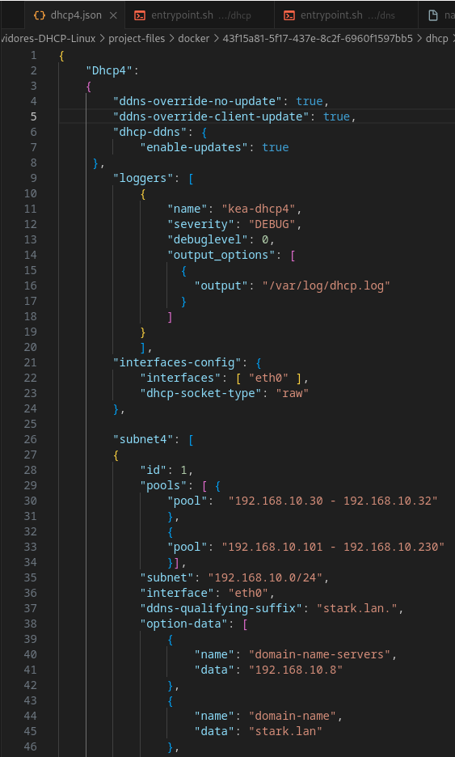
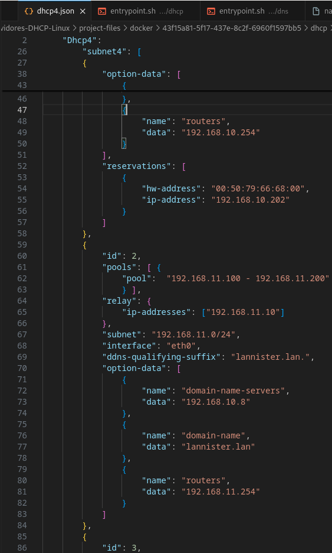

# 1.2 Servidor DHCP Linux

### O equipo arya será o servidore dns para o dominio stark.lan lannister.lan e targaryen.lan

### Instala no equipo ned (Debian) un servidor DHCP coa seguinte configuración:

### 1. Unha subrede para os equipos da rede privada stark.lan 192.168.10.0/24 con 2 pool. Un dos pool, asignará enderezos no rango entre .30 e .32 e outro no rango entre .101 e .230. Estes deberán ter como único servidor dns ao equipo arya

### 2.Unha subrede para os equipos da rede privada lannister.lan 192.168.11.0/24

### 3. Unha subrede para os equipos da rede privada targaryen.lan 192.168.57.0/24  (Conectado ao interface cloud sobre vboxnet1)

### 4. Fai que os log, se amosen no ficheiro /var/log/dhcp.log

### 5. Deberás crear unha reserva estática que estará no rango de enderezos do seu pool correspondente (para o equipo bran)

### 6. Debe actualizar mediante chaves a zona primaria (directa e inversa) no servidor DNS arya.

### 7. Establece os nomes de dominio e servidores DNS  de cada zona.

### 8. Configura nos equipos ned e robb un servizo DHCP failover para a rede stark.lan  e para lannister.lan

### 9. Necesitarás polo menos catro clientes (bran, jon, sansha) para a rede stark e tres para a  rede lannister (jamie). Inclúe capturas de:
- Configuración (grep -v "^#" /etc/kea/kea-dhcp4.conf)

- log de ned visualizando a asignación de enderezos en cada un dos pool e da reserva estática

- Configuración de servidores DNS, router e enderezo IP de cada cliente

- log de ned e robb (simultáneos) facendo unha actualización mediante chaves en arya.

- log de ned visualizando asignacións da segunda subrede (lannister) e actualizacións no servidor dns correspondente.

- Os clientes renovan a concesión

- Comproba a resolución de nomes dos clientes DHCP

### A ter en conta no GNS3

- Para obter o enderezo MAC dos VPCs tecleamos show
- Para obter o enderezo IP dos VPC tecleamos ip dhcp
- Para comprobar os erros do servidor DHCP tecleamos kea-dhcp4 -t /etc/kea/kea-dhcp4.conf
- Para arrancar o servidor DHCP tecleamos /etc/init.d/kea-dhcp4-server ou kea-dhcp4 -c /etc/kea/kea-dhcp4.conf.  Se aparece un erro porque non atopa o ficheiro de leases, creamolo co comando touch
- Para que funcionen os logs hai que iniciar o proceso rsyslogd
- Para parar o servidor dhcp, matamos o proceso con kill -p <pid>  ou killall kea-dhcp. Podemos ver os PID dos procesos con ps aux
- Para activar o servidor relay podemos teclear o comando dhcrelay -i eth0 <ip_dhcp1> <ip_dhcp2>- Configuración dos ambitos e rangos de enderezos

